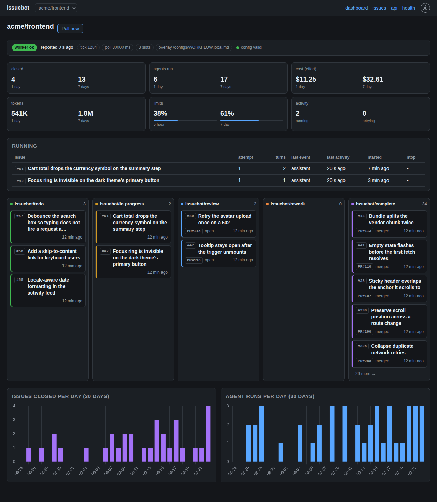

# The dashboard

`issuebot web` serves the board, the hero statistics and every captured turn, for every
repository registered in one store. It reads `DATABASE_URL` and `ISSUEBOT_WEB_PASSWORD` and
nothing else -- no workflow file, no GitHub token -- so it can run somewhere the worker does
not.

The dashboard (`issuebot web`; the compose `web` service publishes it on the host's loopback
at `ISSUEBOT_WEB_PORT`, default 8080) serves every registered repository under
`/r/<owner>/<name>/`: the Kanban of the five label columns, the hero stats, two 30-day
charts, the running agents and, per issue, its runs with the transcript of every captured
turn (scrubbed before it is stored: issuebot's own token, keys and webhook, anything shaped
like a credential, and the operator's home directory never reach the database). `/` redirects to the repository you last picked (a cookie) or the first registered
one, and the header's dropdown switches. `/api/v1/repos` lists every registered worker;
`/api/v1/repos/<owner>/<name>/state`, `/issues/<n>`, `/stats?window=7d` and
`POST /refresh` serve one repository as JSON, and `/healthz` reports the database and,
per repository, its worker's status. It needs `DATABASE_URL`, `ISSUEBOT_WEB_PASSWORD` and
nothing else — no workflow. Turn logs are captured into the database when a run ends, so they
outlive the workspace.

## Access

Authorisation is a property of the request, never of where the socket is bound:
every page, JSON route and raw turn part asks for `ISSUEBOT_WEB_PASSWORD` as HTTP Basic
under any username (the browser prompts once and remembers it; `curl -u
:"$ISSUEBOT_WEB_PASSWORD" http://127.0.0.1:8080/api/v1/repos` from a shell), and a path that
matches nothing challenges too, so no read reaches the database anonymously. `POST
.../refresh`, the one write, asks for one thing more: a browser replays a cached Basic
credential on a form another site submits, so the route also requires a custom request
header, `HX-Request` (any non-empty value; the Poll-now button sends it, a form cannot, and a
cross-site script cannot add it without a CORS preflight the app never answers), and refuses
a request whose `Sec-Fetch-Site` reads `cross-site` outright. Two things stay open:
`/static/`, the vendored assets, and `/healthz` to a probe with no credential, which then
answers liveness alone (`status` and `database`; the workers and their repository names are
for the credential), so compose's healthcheck needs no secret. That anonymous answer is the
verdict the process already holds, refreshed by at most one connection every ten seconds
however many probes arrive (a failure is held for the same ten seconds, so the healthcheck
can read 503 that long after the database is back; the credential's own probe is live, and
refreshes it too), so a flood of anonymous probes cannot use up the hub cluster's
connections, which every worker's sink and refresh listener share. Every response
carries the same four security
headers, the 500 an unhandled exception becomes included. A credential that is presented
and wrong is a 401 everywhere and a `web_auth_rejected` log line naming the path and the
client, never the value. `issuebot web` refuses to start without the password (`[FAIL]
web: not configured; export ISSUEBOT_WEB_PASSWORD`; it reads the environment only, since a
flag would show in `ps`) and binds `127.0.0.1` unless told `--bind 0.0.0.0`; the compose
service says so explicitly behind a port it publishes on the host's loopback. Basic sends the
password with every request, so a dashboard that leaves the host wants TLS in front of it.

## A browser that will not speak Basic

Basic is the gate, so a browser configured not to use
it cannot reach the dashboard at all: a managed Edge or Chrome whose `AuthSchemes` policy omits
`basic` — `ntlm,negotiate` is a common fleet setting — has no handler for the challenge, so it
renders the 401 page without ever prompting. The server's own log is the giveaway: the 401 is
there and no `web_auth_rejected` beside it, because nothing was presented to reject. Check
`edge://policy` or `chrome://policy` before suspecting the deployment. Neither TLS nor
credentials in the URL get round it, since `AuthSchemes` lists schemes rather than restricting
the transport (that is `BasicAuthOverHttpEnabled`, a separate policy); another browser, or
cookie-based authentication in front of the dashboard, is the way in.

## The hero's six tiles

Closed, agents run, cost, tokens, limits and activity, each showing
two figures: 1 day and 7 days for the first four, the two usage windows for limits, and
running against retrying for activity.

The limits tile is what a Claude subscription is actually rationed by. `claude` reports the
share of each usage window an account has spent, every worker session forwards the newest
reading it sees, and the tile shows the two as percentages used with a depletion bar. A
reading only arrives while a turn is running, so between runs the last one ages — but a window
whose reset time has passed has genuinely rolled over and nothing has run since to spend the
new one, so it reads 0% rather than repeating a figure that stopped being true at the reset.
Each window's tooltip carries the reset time and how old the reading is. The worker reads its
last reading back out of the stored snapshot when it starts, so a restart — which is how it is
deployed — does not blank the tile until the next dispatch.

The cost tile is labelled for what is being spent, from the same `claude auth status` probe the
worker runs at startup: `cost (effort)` on a subscription, where there is no per-token charge
and the figure is an effort measure, `cost (actual)` on an API key, where it is money. An API
key has no usage windows at all, so the limits tile reads N/A there. A worker that has never
seen a reading shows an em dash instead — nothing has run, rather than nothing can ever apply,
and it fills in on its own. A probe too ambiguous to call — a login with `ANTHROPIC_API_KEY` also set,
which `validate` warns about — leaves the tile labelled plainly `cost`, but still shows any
reading it has.

## What "issues closed" counts

The hero's 1d/7d closed tiles, the closed series on the
30-day chart and `issuebot stats` all count issues the worker resolved: closed by a merged
pull request, or closed after a session found no fault. Both end up labelled
`issuebot/complete`, so they are the issues that end up in that column (the tiles are windowed
on the GitHub close time; the column itself is not). An issue closed
without either — abandoned rather than investigated — loses its state label and is counted
nowhere; the `issue_cancelled` event on its timeline is the record of it.
